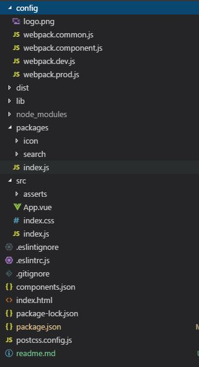

## 前端学习之路及前端架构的演进一些思考
最近这些年前端发展十分迅猛，各种框架，插件，组件库如雨后春笋，让人应接不暇。很多刚进去前端开发的同学可能会眼花缭乱，不知从何入手。这篇文章主要讲下我自身前端学习之路，以及项目中前端架构的演进过程中的一些知识点。 
和大多数人一样，学习过程是曲折的，这里写出来，给有过相似困惑的人一些参考。 
废话不多，现在就开始，我将学习划分了5个阶段，懵懂、初识、入门、深入和高级。 
### 懵懂
刚开始工作那会，被分配到了前端开发组，找了一些教程学习html，js，css这三块内容，掌握了基础知识后，开始写一些静态页面，开始使用ajax请求后台数据渲染页面,也开始了前端的开发之路。 
**技术栈： HTML， JS， CSS**

### 初识
经过一段时间的入职培训后，进入项目组，开始开发实际功能。很多时候为了实现某个功能花费很长时间，浪费时间不说，而且经常bug不断。开始找现成的方案来解决项目问题，于是开始学习UI框架或js库等等，例如Jquery，Bootstrap。 
**技术栈： SpringBoot/SpringMVC + js类库（Jquery，echarts等）+ UI组件库（Bootstrap等）**

### 入门
随着功能的扩展，项目变得越来越大，各种JS、css文件体积越来越大，越来越不可控，页面加载速度越来越慢，而且会有一些兼容性的考虑。这个时候开始考虑优化，同时考虑如何管理前端文件。 
所以就开始考虑如何构建前端工程，至此引入了node，npm和webapck。（当然构建前端工程还有其它选择，这个只是引子。）,同时为了实现各类功能，引入了各种包（了babel，polyfill） 
这个时候前端项目算是从Spring工程中独立出来了，前后台人员也逐渐分离。 
**技术栈： 
构建前端项目：webpack，npm 
代理或数据模拟： node，express 
后端：SpringBoot，mysql,mybatis/JPA等等 **
前后端分离后，我们经常开发时，很多ajax请求数据需要模拟，可以用node+express搭建一个简单的后台服务，也可以用一些js插件mock数据。 

### 深入
这个时候虽然前端项目独立了，但项目中的很多页面中的代码相似，代码的复用率不高，觉得有必要进行组件化，把具有共性的东西抽象出来，提高效率。 
这个时候开始决定采用框架进行开发。开始纠结选择哪个框架，Vue，React或是Angular等等，后来决定用了Vue(现在看来选择哪个框架没那么大区别，不同框架提供的功能是相似的)。这个时候，页面开始分解为各个组件，公共的东西出来了，开发效率也提高了。 
**技术栈：webpack ， vue**

### 高级
经过一段时间，问题又出来了，不同项目间其实有很多共同的东西，项目间代目复制也挺麻烦，这个时候需要抽象出常用的组件库，新项目需要使用组件，直接使用npm安装即可。 

这个时候就有两个问题了：  

1、npm安装的组件库放在哪？ 
npm可以安装npm仓库上的包，git仓库的包。于是就有了一下选择： 
a、将公司的私有代码放在npm仓库上。这肯定不可以，npm包可以控制权限也不行，所以这个方案不行。 
b、代码放到公司的私有git仓库上，这个是可以的。 

2、组件库如何开发？ 
现在是采用vue框架开发，自然想到组件库以vue为基础。 
vue提供了比较完善的插件机制，开发插件的教程地址： https://cn.vuejs.org/v2/guide/plugins.html 。 

我搭建了一个Vue组件库工程demo，类似element-ui。 
git地址： https://github.com/xubaodian/Wstl-UI.git  
工程目录如下： 
 
解释一下： 
config文件夹下是webpack配置: 
webpack.dev.js:启动example的webpack配置，example用来测试组件 
webpack.prod.js:生成example的生产环境文件的webpack配置 
webpack.common.js:打包组件库的webpack配置，所有组件生成一个js文件和一个css文件 
webpack.component.js:分开打包组件的webpack配置，每个组件生成一个js文件和一个css文件 
具体实现可参考代码，代码中有注释。
